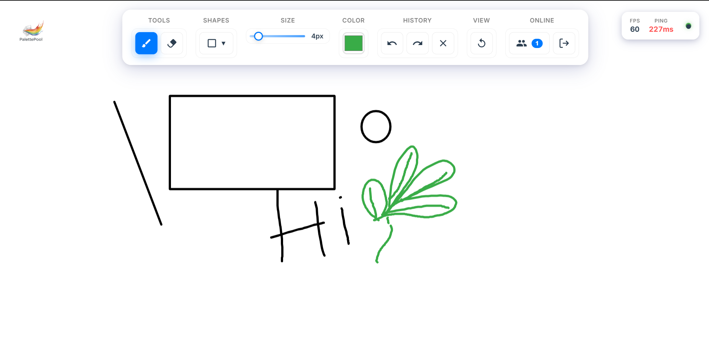
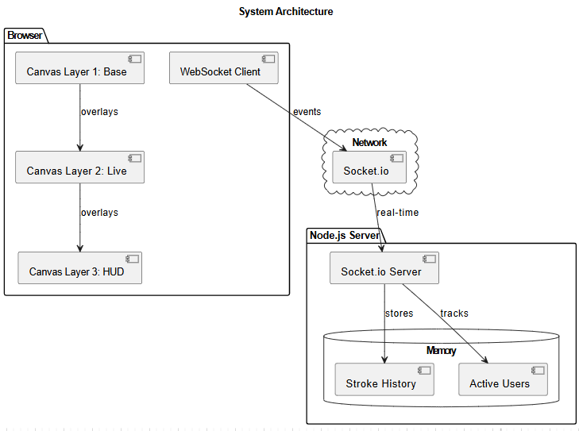
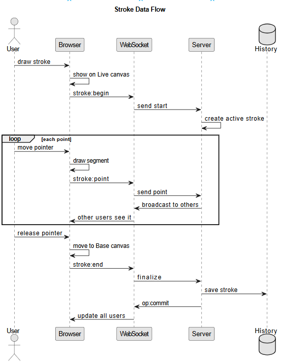

# Collaborative Canvas

A real-time multiplayer drawing application built with TypeScript and Socket.io. Draw together with others in real-time, featuring live cursors, multiple tools, and synchronized undo/redo.



## Features

- **Drawing Tools**: Brush, eraser, line, rectangle, and ellipse with customizable colors and sizes
- **Real-time Collaboration**: See others drawing in real-time with live cursors showing their names
- **Global Undo/Redo**: Synchronized undo/redo that works across all connected users (Ctrl+Z/Ctrl+Y)
- **Auto-Reconnection**: Automatic reconnection on network failures with session restoration
- **Mobile-Friendly**: Responsive design with touch support, pinch-to-zoom, and two-finger pan
- **Infinite Canvas**: Pan and zoom with smooth navigation and world-coordinate system
- **Performance Stats**: Real-time FPS counter and latency monitoring
- **Interactive Tutorial**: First-time user guide with step-by-step tool introduction
- **Session Persistence**: Your username and preferences saved across visits

## Quick Start

```bash
npm install
npm start
```

Open https://collaborative-canvas-t753.onrender.com/ in multiple browser tabs to try collaborative drawing.

## Project Structure

```
collaborative-canvas/
├── client/
│   ├── main.ts          # Event handling, tool logic, UI coordination
│   ├── renderer.ts      # Three-layer canvas rendering system
│   ├── websocket.ts     # Socket.io client with reconnection logic
│   ├── canvas.ts        # Canvas utilities and coordinate transforms
│   ├── index.html       # UI structure
│   └── style.css        # Responsive styles with Apple-inspired design
├── server/
│   ├── server.ts        # Express + Socket.io server
│   ├── rooms.ts         # User and room management
│   └── drawing-state.ts # Authoritative stroke history with undo/redo
└── package.json
```

## How It Works

### Architecture Overview



The system uses a client-server architecture where the server maintains authoritative state and broadcasts updates to all connected clients.

### Three-Layer Canvas System

Canvas Layers
The app uses three stacked canvases to prevent visual artifacts during concurrent drawing:
- **Base Canvas**: Finalized strokes (replayed from server history)
- **Live Canvas**: In-progress strokes (being drawn right now)
- **HUD Canvas**: Cursors, overlays, and UI elements

### Real-time Stroke Streaming



Instead of sending complete strokes, the app streams drawing points in real-time:
1. `stroke:begin` → Announces new stroke (tool, color, size)
2. `stroke:point` → Streams each point as you draw
3. `stroke:end` → Finalizes the stroke

This creates a truly collaborative "drawing together" experience.

## Development

```bash
npm run dev    # Start with auto-reload (recommended for development)
npm run build  # Compile TypeScript
npm start      # Build and run production server
```

## Testing Multi-User

**User Testing:**
- Open multiple browser tabs at https://collaborative-canvas-t753.onrender.com/
- Draw in one tab and watch it appear in others


## User Experience

### First Visit
1. Splash screen with rainbow animation (2 seconds)
2. Name input screen
3. Interactive tutorial (5 steps introducing tools)
4. Canvas ready to draw

### Returning Users
- Your name is saved in localStorage
- Splash screen and name input are skipped
- If you completed the tutorial before, you go straight to drawing
- If you skipped the tutorial, it shows again (you can complete it to not see it again)
- Simply reload the page to rejoin with your saved name

### Leave Session & Start Fresh
- Click the **Leave Session** button (🚪 icon) in the toolbar
- Confirms before clearing your saved name and tutorial progress
- Page reloads with full onboarding flow
- Perfect for switching to a different name or starting over

## Navigation & Controls

**Desktop:**
- Pan: Hold `Space` and drag, or mouse wheel to scroll
- Zoom: `Ctrl` + mouse wheel (centered on pointer)
- Undo/Redo: `Ctrl+Z` / `Ctrl+Y` or toolbar buttons
- Reset View: Button to return to 100% zoom

**Mobile:**
- Draw: Single finger
- Pan: Two-finger drag
- Zoom: Pinch gesture
- Responsive toolbar collapses on smaller screens

**Infinite Canvas:** All strokes stored in world coordinates, render correctly at any zoom level.

## Mobile Features

## Mobile Features

- High-DPI rendering for crisp graphics on Retina displays
- Pointer capture prevents dropouts during drawing
- Two-finger pan and pinch-zoom
- Responsive toolbar (collapses under 700px width)
- Orientation changes preserve content

## Limitations

- **No Persistence**: In-memory only (server restart = data loss)
- **Single Server**: Load balancing needs shared state (Redis/database)
- **Undo Limit**: Max 5 operations for performance
- **No Room Codes**: Everyone joins the default room

## Future Ideas

- Database persistence
- Private rooms with codes
- More tools (fill bucket, text, images)
- Export to PNG/SVG
- Stroke smoothing
- User authentication
- Wake Lock API


---

Built with vanilla TypeScript and Socket.io

